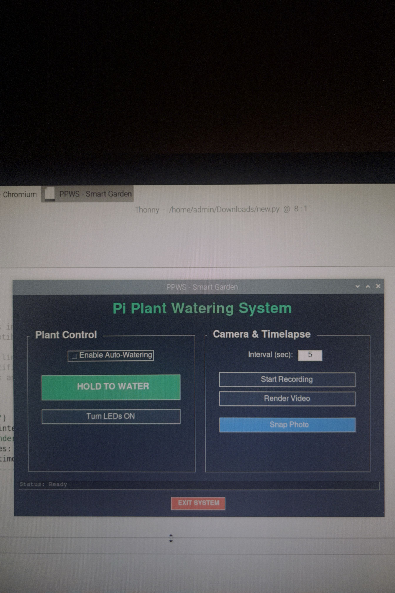
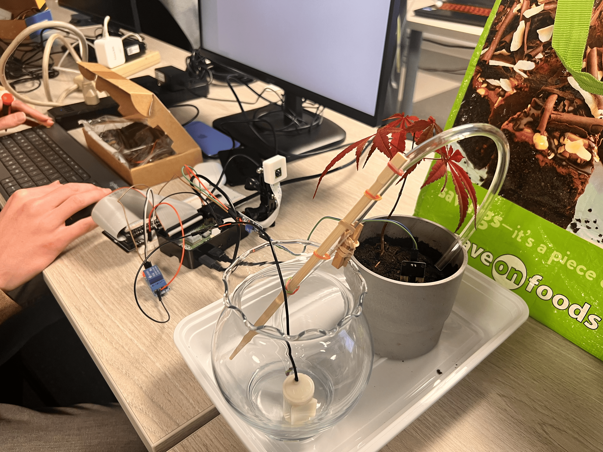

# 🌱 PPWS - Pi Plant Watering System


**PPWS** is an automated gardening assistant powered by the Raspberry Pi. It monitors soil moisture levels in real-time, automatically waters your plant when it gets thirsty, and creates beautiful timelapse videos of your plant's growth using the Pi Camera.

The project features a modern **Tkinter GUI** for local control and an **Email Listener** for remote commands.

## 🖼️ Prototype Gallery


*Figure 1: Front view of the enclosure and UI.*


*Figure 2: Internal wiring and component layout.*


*Figure 3: Assembled Project Real View.*

---

## ✨ Features

* **💧 Auto-Watering:** Continuously monitors soil moisture sensors and activates the pump relay when the soil is dry.
* **📧 Remote Control:** Send email commands to the Pi to request status updates, photos, or videos.
* **📸 Timelapse Engine:** Captures photos at set intervals and renders them into a video (`.mp4`) using FFmpeg.
* **🎮 Manual Control:** Touchscreen-friendly "Hold-to-water" button and LED toggles.
* **🌙 Dark Mode GUI:** A polished, eye-friendly interface built with Python Tkinter.

---

## 🛠️ Hardware Required

* **Raspberry Pi 4** (or 3B+)
* **Capacitive Soil Moisture Sensor** (v1.2 recommended)
* **5V Relay Module** (Active LOW)
* **Mini Submersible Water Pump** (3V-5V) + Tubing
* **Raspberry Pi Camera Module** (Works with libcamera / Picamera2)
* **External Power Supply** (For the pump - **Important!**)
* **Breadboard & Jumper Wires**
* **3x LEDs** (Status indicators)

---

## 🔌 Circuit Diagram & Wiring

> **⚠️ SAFETY WARNING:** Do not power the water pump directly from the Raspberry Pi's 5V pin. Motors draw high current and can damage your Pi. Use an external power source for the pump, connecting the **Grounds** together.


### Pin Mapping (BCM)

| Component | BCM Pin | Physical Pin | Note |
| :--- | :--- | :--- | :--- |
| **Moisture Sensor** | GPIO 16 | Pin 36 | Input (High = Dry) |
| **Pump Relay** | GPIO 20 | Pin 38 | Output (Active Low) |
| **LED 1** | GPIO 5 | Pin 29 | Status Light |
| **LED 2** | GPIO 12 | Pin 32 | Status Light (Updated) |
| **LED 3** | GPIO 13 | Pin 33 | Status Light |

---

## 🚀 Installation & Setup

### 1. System Prerequisites
Update your Raspberry Pi and install the necessary system packages. **FFmpeg** is required for video rendering.

```bash
sudo apt update
sudo apt install python3-tk python3-pip ffmpeg libcamera-apps